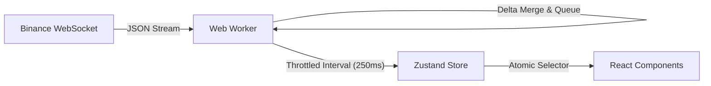

# TBT Paper Terminal


<div align="center">
  <h2>Frontend-only Crypto Trading Simulation</h2>
  <h3>纯前端加密货币仿真交易终端</h3>
  <p>
    Connects directly to Binance Public WebSocket API. No Backend Required.<br>
    直连 Binance 公共 WebSocket API。无需后端支持。
  </p>
  <p>
    <a href="docs/README_ARCHITECTURE.md"><b>Architecture Docs (架构文档)</b></a> |
    <a href="docs/benchmarks.md"><b>Performance Benchmarks (性能基准)</b></a>
  </p>
</div>

---

## 🏗 What it is / 项目定位

<div align="center">
  
  <p><i>Desktop Pro Interface: Order Book, Chart, and Trade History</i></p>
</div>

### ✅ It is / 核心特性

* **High-Frequency Data Visualization**: Renders 50+ updates/sec OrderBook via `WebWorker` + `Canvas`.
* **Dual-Platform UX**: Dedicated mobile routing (`/mobile/*`) vs Desktop dashboard.
* **Financial Sandbox**: Risk-free simulation with strict `decimal.js` arithmetic.
* **Zero-Backend**: Client-side matching engine and state persistence.

### ❌ It isn't / 非核心特性

* Not a real exchange (No custody, no settlement).
* Not a trading bot (No automated execution strategies).

---

## 📱 Mobile-First Experience / 移动端极致适配

The project features a **Native-App Like** experience on mobile. It uses **adaptive routing** to serve a completely different UI structure optimized for touch, rather than just responsive scaling.
项目在移动端提供了**类原生 App** 的体验。通过**自适应路由**（Adaptive Routing）根据设备类型加载两套完全独立的组件结构，而非简单的 CSS 缩放。

> **Implementation Evidence**: See `src/components/Layout/AdaptiveLayout.tsx` for branching logic.

<div align="center">
  <table style="border: none; border-collapse: collapse; width: 100%;">
    <tr>
      <td align="center" width="25%" style="border: none; padding: 10px;">
        
        <br><b>Market List<br>行情列表</b>
      </td>
      <td align="center" width="25%" style="border: none; padding: 10px;">
        
        <br><b>Trading & Order<br>交易与下单</b>
      </td>
      <td align="center" width="25%" style="border: none; padding: 10px;">
        
        <br><b>Market Depth<br>深度图表</b>
      </td>
      <td align="center" width="25%" style="border: none; padding: 10px;">
        
        <br><b>Asset & PnL<br>资产盈亏</b>
      </td>
    </tr>
  </table>
</div>

---

## ⚡ Architecture & Performance / 架构与性能

### 4.1 Data Flow / 数据流向 (Fixed)



### 4.2 Performance Tactics / 性能策略

1. **Off-Main-Thread Processing (Worker)**
    * *Why*: Parsing 100+ JSON messages/sec blocks UI interactions.
    * *How*: `src/worker/marketDataWorker.ts` runs in a separate thread.

2. **Render Throttling (Batching)**
    * *Why*: React cannot reconcile 60fps state updates without lag.
    * *How*: Worker accumulates updates and emits only 4 snapshots/sec to the Main Thread.

3. **Atomic State Updates**
    * *Why*: `Context API` triggers full-tree re-renders on price ticks.
    * *How*: `useStore(state => state.specificSlice)` ensures only relevant cells re-render.

> See [docs/benchmarks.md](docs/benchmarks.md) for verification steps.

---

## 5. Engineering Standards / 工程标准

* **Precision Math**: NO floating point errors. All math uses `decimal.js` (Evidence: `src/utils/decimal.ts`).
* **Type Safety**: `strict: true` enabled in `tsconfig.json`.
* **State Management**: Domain-driven stores strategy (`trading`, `wallet`, `market` split).
* **Error Handling**: Built-in exponential backoff for WebSocket reconnection.

---

## 6. Getting Started / 快速运行

**Prerequisites**: Node.js 18+

```bash
# 1. Clone
git clone https://github.com/TheNewMikeMusic/tbt-paper-terminal.git

# 2. Install
npm install

# 3. Dev Server
npm run dev
# -> http://localhost:5173 (Auto-detects Mobile/Desktop)
```

---

<p align="center">
  <sub>Data source: Binance Public API. Educational use only.</sub>
</p>
