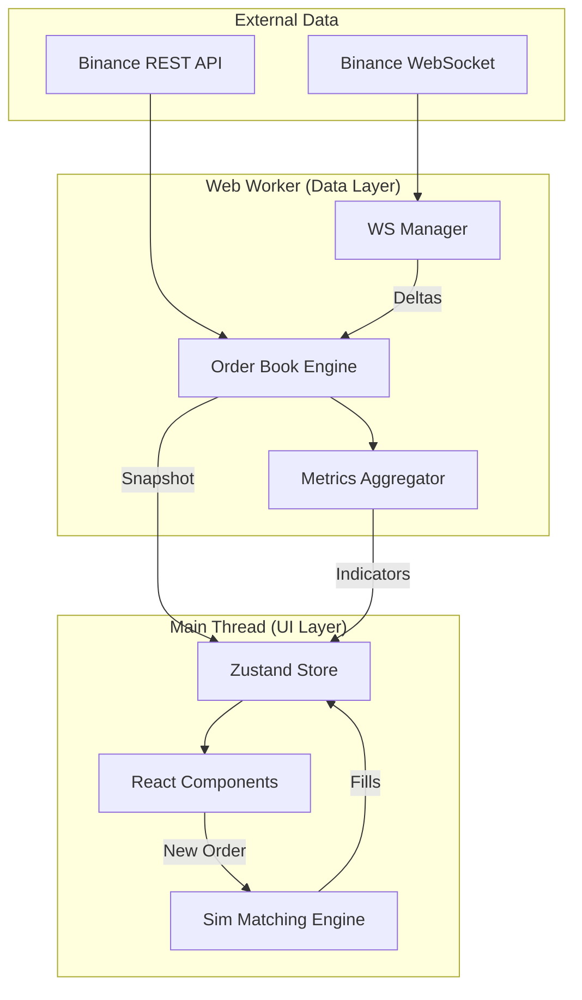

# 🚀 TBT Paper Terminal

<p align="center">
  
</p>

<p align="center">
  <b>A professional-grade paper trading terminal for cryptocurrency markets.</b><br>
  Experience institutional-level data handling and professional UI with zero financial risk.
</p>

<p align="center">
  
  
  
  
  
</p>

---

## ✨ Features Highlight

### 📊 Market Intelligence
*   **High-Fidelity Order Book**: Real-time snapshot + delta merging with sequence validation and auto-resync.
*   **Microstructure Indicators**: 8 built-in real-time metrics including **Bid/Ask Imbalance**, **Micro Volatility**, and **VWAP**.
*   **Data Confidence Bar**: Full transparency on connection health, latency (RTT), and data freshness.

### ⚡ Professional Trading Engine
*   **Focus Mode**: Intelligent layout locking during order entry for maximum precision.
*   **Simulated Matching**: Market and Limit orders matched against real-time Binance liquidity.
*   **Risk Ribbon**: Visual risk assessment for position sizing and P&L monitoring.

### 🎨 Modern UI/UX
*   **Dual Themes**: Professional Dark and Light modes out of the box.
*   **Performance First**: Heavy computations (Order book merging, metrics) offloaded to **Web Workers**.
*   **Accessibility**: Color-blind friendly indicators (▲▼) and tabular numeric fonts.

---

## 📸 Interface Preview

| 🌓 Light Mode | 🌑 Dark Mode |
|:---:|:---:|
|  |  |
| *Clean, professional typography* | *Optimized for long-session trading* |

---

## 🛠 Tech Stack

Designed for speed, precision, and educational clarity.

*   **Core**: React 18 + TypeScript
*   **State Management**: Zustand (Atomic subscriptions)
*   **Data Processing**: Web Workers (Dedicated thread for streaming data)
*   **Financial Math**: `decimal.js` for floating-point safety
*   **Visualization**: `lightweight-charts` for high-performance price action

---

## 📉 The 8 Alpha Indicators

The terminal calculates these metrics every 100ms in a background worker:

1.  **Mid Price**: The fair market value baseline.
2.  **Spread**: Real-time liquidity cost (Absolute & Bps).
3.  **Bid/Ask Imbalance**: Buy/Sell pressure signal (-1 to +1).
4.  **Micro Volatility**: 60s rolling risk assessment (Welford algorithm).
5.  **Trade Intensity**: Market activity pulse (Trades per 10s).
6.  **VWAP (60s)**: Volume-weighted average price.
7.  **Liquidity Score**: Log-normalized depth/spread ratio (0-100).
8.  **Slippage Estimate**: Projected price impact for market orders.

---

## 🏗 System Architecture



---

## 🚀 Quick Start

```bash
# Clone the repository
git clone https://github.com/TheNewMikeMusic/tbt-paper-terminal.git

# Install dependencies
npm install

# Start the development server
npm run dev

# Run unit tests
npm test
```

---

## ⚠️ Disclaimer

- **NOT financial advice**: This is for educational and portfolio purposes only.
- **Paper trading only**: No real money or real trades are ever executed.
- **Data Source**: Uses public Binance API. Not affiliated with Binance.

---

<p align="center">
  Built with ❤️ for the Trading Community.
</p>
