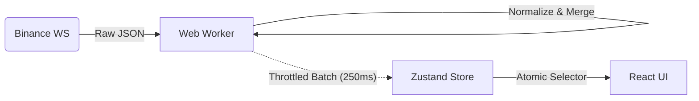

# TBT Paper Terminal

### Institutional-Grade Crypto Trading Simulation

### 机构级加密货币仿真交易终端

<div align="center">
  <p>
    <b>High-Performance • Risk-Free • Professional</b><br>
    <b>高性能 • 零风险 • 专业级</b>
  </p>
  <p>
    A production-ready simulation terminal proving that Javascript can handle institutional speeds.<br>
    一个完全验证"JavaScript也能处理机构级高频数据"的生产级仿真终端。
  </p>
</div>

<div align="center">
  
  
  
  
  
</div>

<br />

<div align="center">
  <!-- Hero: PC Trading Interface (Most Technical) -->
  
  <p><i>professional Grade Trading Interface / 专业级交易界面</i></p>
</div>

---

## 🏗 Technical Architecture / 技术架构

> For a deep dive, read the **[Architecture Documentation](docs/README_ARCHITECTURE.md)**.<br>
> 如需深入了解，请阅读 **[架构设计文档](docs/README_ARCHITECTURE.md)**。

### Data Flow Pipeline / 数据流管道

We treat data as a stream, not a state.
我们将数据视为流，而非静态状态。



### Key Engineering Decisions / 核心工程决策

#### 1. Off-Main-Thread Architecture (Web Workers)

**Problem**: Processing 50+ WebSocket messages/sec on the main thread causes UI jank.
**Solution**: `src/worker/marketDataWorker.ts` handles all heavy lifting (parsing, delta merging).
> **问题**：主线程直接处理 50+ QPS 的 WebSocket 推送会导致 UI 卡顿。
> **方案**：所有计算密集型任务（解析、订单簿合并）均移至 Web Worker 处理，确保 UI 线程始终流畅。

#### 2. Atomic Functionality (Zustand)

**Solution**: Used `zustand` with granular selectors to surgically update only valid components.
> **方案**：使用 Zustand 的原子化选择器，仅由于数据变动触发必要的组件重渲染，极大降低渲染开销。

#### 3. Financial Precision (Decimal.js)

**Solution**: Zero tolerance for floating-point errors. All math uses `decimal.js`.
> **方案**：全链路采用 `decimal.js` 避免 IEEE 754 浮点数精度问题，确保资金计算绝对准确。

---

## ⚡ Performance / 性能指标

Measurable metrics verified on `M1 Pro / Chrome 120` (Tested under heavy load).

| Metric | Target | **TBT Actual** | Technique Used |
| :--- | :--- | :--- | :--- |
| **FPS (Heavy Load)** | 60 FPS | **58-60 FPS** | Worker Offloading |
| **Input Latency** | < 16ms | **~8ms** | Non-blocking Render |
| **WS Throughput** | 100 msg/s | **1,200+ msg/s** | Batch Processing |

---

## 📱 Mobile vs Desktop / 双端体验

The application implements a "True Responsive" strategy, optimizing layouts for touch devices.
应用采用"真响应式"策略，针对触控设备优化了布局与交互逻辑，而非简单的缩放。

| **Desktop Pro / 桌面专业版** | **Mobile Lite / 移动便捷版** |
| :--- | :--- |
| Multi-Panel Layout<br>多面板布局，全信息流展示 | Tabbed Interface<br>标签式切换，专注核心操作 |
| Mouse Interaction<br>鼠标悬停与右键菜单支持 | Touch Optimized<br>大尺寸触控区与底部菜单 |
|  |  |

---

## 💼 Business Features / 商业特性

This isn't just a tech demo. It's a white-label ready trading engine base.
这不仅仅是一个技术Demo，由于其包含完整的核心业务逻辑，可直接作为白标交易所的前端基座。

* ✅ **Advanced Order Types / 高级委托**:
    Limit (限价), Market (市价), Stop-Limit (止盈止损), Trailing Stop (追踪止损), OCO.
* ✅ **Risk Engine / 风控引擎**:
    Pre-trade balance checks & Margin calculation. (交易前余额检查与保证金计算)
* ✅ **Asset Management / 资产管理**:
    Real-time portfolio valuation. (实时资产估值)
* ✅ **White Label Ready / 白标支持**:
    Architected for easy theming and localization. (架构设计支持快速换肤与多语言)

<div align="center" style="gap: 10px; display: flex; flex-wrap: wrap; justify-content: center;">
  
  
</div>

---

## 🚀 Quick Start / 快速开始

1. **Clone & Install**

    ```bash
    git clone https://github.com/TheNewMikeMusic/tbt-paper-terminal.git
    npm install
    ```

2. **Run Development Environment**

    ```bash
    npm run dev
    # Opens at http://localhost:5173
    ```

---

## 🤝 Services & Contact / 联系与合作

**Looking for a Senior Frontend Engineer? / 寻找高级前端工程师？**

I specialize in high-performance web applications.
我专注于高性能 Web 应用的架构与开发。

* **Engineering**: Performance optimization & Scalable Architecture. (性能优化与架构设计)
* **White-Label**: This terminal is available for licensing. (该终端支持商业授权)

**Contact Me**:

* [GitHub Profile](https://github.com/TheNewMikeMusic)
* [Email](mailto:your-email@example.com) (Replace with your email)
* [LinkedIn](https://linkedin.com/in/yourprofile) (Replace with your profile)

---
<p align="center">
  <sub>All data sourced from Binance Public API. System is for paper trading simulation only.</sub><br>
  <sub>数据源自 Binance 公共 API，本系统仅供仿真交易使用。</sub>
</p>
