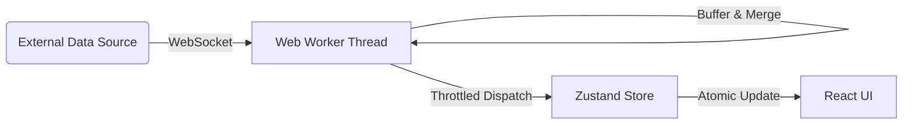

# TBT Exchange UI Kit


<div align="center">
  <h2>The "Hard Parts" of Crypto Exchange Frontend—Solved.</h2>
  <h3>解决加密货币交易所前端开发中"最难啃的骨头"。</h3>
  <p>
    A professional-grade React codebase featuring <b>WebWorker offloading</b>, <b>Order Book merging</b>, and <b>High-Precision Math</b>.<br>
    Use this as a simulation terminal or the foundation for your next exchange project.<br>
    包含 WebWorker 线程卸载、订单簿合并算法和高精度金融计算的专业级 React 代码库。<br>
    既是完美的仿真终端，也是你下一个交易所项目的最佳起步基座。
  </p>
  <br>
  <p>
    <a href="docs/README_ARCHITECTURE.md"><b>Architecture Docs (架构文档)</b></a> |
    <a href="docs/benchmarks.md"><b>Performance Benchmarks (性能基准)</b></a>
  </p>
</div>

---

## 💎 Why using this? / 核心价值

<div align="center">
  
</div>

Building a trading interface is difficult. You have to handle thousands of WebSocket messages per second without freezing the browser. **We've solved these engineering challenges for you.**
开发交易界面很难。你必须在不阻塞浏览器的情况下处理每秒数千条 WebSocket 消息。**我们已经为你解决了这些工程难题。**

### 🚀 For Developers / 开发者价值

* **Save 200+ Development Hours**: Skip the boilerplate of setting up WebSocket managers, buffer queues, and decimal arithmetic.
* **Backend Agnostic Pattern**: The UI is fully decoupled from the simulation logic. Replace `marketDataWorker.ts` with your own API client, and the UI just works.
* **Production-Ready Architecture**:
  * **Worker Thread**: `src/worker/` handles data ingestion.
  * **Atomic Store**: `src/store/` handles state without re-rendering the world.
  * **Responsive**: `src/pages/mobile/` handles touch interactions.

---

## 🛠 Reusable Modules / 可复用模块

This repository is modular by design. You can rip out these subsystems and use them in your own apps.
本仓库采用模块化设计。你可以直接剥离以下子系统并用于你自己的应用中。

| Module | What it does | Location |
| :--- | :--- | :--- |
| **Order Book Engine** | Merges snapshots + incremental deltas (`u`, `U`), checks continuity, and emits throttled updates. | `src/worker/` |
| **Matching Simulation** | A client-side matching engine supporting Limit, Market, Stop-Limit, and OCO orders. Perfect for testing UIs without a backend. | `src/store/tradingStore.ts` |
| **Adaptive Layout** | A robust pattern for serving completely different component trees to Mobile/Tablet/Desktop users based on intent, not just screen width. | `src/components/Layout/` |
| **Precision Math** | A strict wrapper around `decimal.js` ensuring no IEEE 754 errors leak into your UI. | `src/utils/decimal.ts` |

---

## 📱 Dual-Platform Experience / 双端体验

We don't believe in "squashing" a complex trading desk into a mobile screen. We built two separate experiences that share the same data core.
我们不相信"缩放"能解决复杂交易台在手机上的展示问题。我们构建了共享同一数据核心的两套独立体验。

<div align="center">
  <table style="border: none; border-collapse: collapse; width: 100%;">
    <tr>
      <td align="center" width="25%" style="border: none; padding: 10px;">
        
        <br><b>Market List<br>行情列表</b>
      </td>
      <td align="center" width="25%" style="border: none; padding: 10px;">
        
        <br><b>Trading & Order<br>交易与下单</b>
      </td>
      <td align="center" width="25%" style="border: none; padding: 10px;">
        
        <br><b>Market Depth<br>深度图表</b>
      </td>
      <td align="center" width="25%" style="border: none; padding: 10px;">
        
        <br><b>Asset & PnL<br>资产盈亏</b>
      </td>
    </tr>
  </table>
</div>

---

## ⚡ Architecture / 架构设计

Designed for high-throughput (HFT) environments. The UI thread is protected at all costs.
专为高吞吐（HFT）环境设计。不惜一切代价保护 UI 线程的流畅性。



* **Ingestion**: `marketDataWorker` absorbs the 50msg/s firehose.
* **Throttling**: React only receives updates at 60fps (or configurable interval), preventing render trashing.
* **Separation**: Business logic lives in Stores/Workers, not Components.

---

## 🚀 Quick Start / 快速开始

Clone this repo to start your own highly performant simulated exchange.

```bash
# 1. Clone
git clone https://github.com/TheNewMikeMusic/tbt-paper-terminal.git

# 2. Install
npm install

# 3. Dev Server
npm run dev
# -> http://localhost:5173
```

### Configuration

No API keys needed. The project connects to Binance Public Streams by default. To connect to your own backend, simply modify the WebSocket URL in `src/worker/marketDataWorker.ts`.

---

<p align="center">
  <sub>Open Source (MIT). Free to fork, modify, and use for your own commercial or private projects.</sub><br>
  <sub>开源项目 (MIT)。可自由 Fork、修改并用于商业或个人项目。</sub>
</p>
